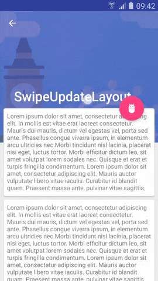

SwipeUpdateLayout
---

SwipeUpdateLayout allows you to get latest data or older data by swipe up or down.



### Usage

Include the `library` module into your project, refer to the example in `app` module.  

``` xml
<org.gnayils.android.widget.SwipeUpdateLayout xmlns:android="http://schemas.android.com/apk/res/android"
    xmlns:app="http://schemas.android.com/apk/res-auto"
    android:id="@+id/swipeupdatelayout"
    android:layout_width="match_parent"
    android:layout_height="match_parent"
    app:updatePosition="both"
    app:freezeContent="top">
    
    <FrameLayout/>
    
</org.gnayils.android.widget.SwipeUpdateLayout>
```
``` java
swipeUpdateLayout.setOnUpdateListener(new SwipeUpdateLayout.OnUpdateListener() {
    @Override
    public void onUpdate(int updatingPosition) {
        if(updatingPosition == SwipeUpdateLayout.AT_TOP) {
            System.out.println("get latest data");
        } else if(updatingPosition == SwipeUpdateLayout.AT_BOTTOM) {
            System.out.println("get older data");
        }
    }
});
```